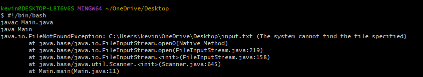

# Lab Report 5 

## Title: Debugging Scenario - Conversation on EdStem

*Embarking on this debugging journey, I initiated a conversation on EdStem to address an unexpected behavior encountered while executing my Java program.  
Following are the threads:* 

*STUDENT:*  
Title: Debugging Scenario  
Body:
Hi everyone,    
I'm having trouble running my Java program. I'm trying to run the Main class, but I keep getting the following error message:    
  
I think the issue might be with the input file, but I'm not sure. Can anyone help me out?    

*TA:*  
Title: Debugging Scenario  
Body:
Hello there,  
I appreciate you getting in touch. Could you try executing the following command and report back to me with your findings?
```java -cp . Main input.txt```

*STUDENT:*  
Title: Debugging Scenario    
Body:  
Hey, I tried the command and this was my outcome:


*TA:*  
Title: Debugging Scenario    
Body:  
Hi,  
So, this result reveals that the issue is a FileNotFoundException of the input.txt file. The error message FileNotFoundException is thrown when the named file does not exist, the pathname is incorrect, the pathname contains non-printing characters, the pathname is relative and does not resolve correctly relative to the actual current directory of the running application, the path to the file is broken, or the named file is actually a directory. For further information, can you please send me your code.

Student:
Title: Debugging Scenario  
Body:  
Hi, Thank you very much for the information.   
ALso, following is my code:  

```import java.io.File;
import java.io.FileNotFoundException;
import java.util.Scanner;

public class Main{
    public static void main(String[] args) {
        String fileName = "input.txt";
        File file = new File(fileName);
        Scanner scanner;
        try {
            scanner = new Scanner(file);
            while (scanner.hasNextLine()) {
                String line = scanner.nextLine();
                System.out.println(line);
            }
            scanner.close();
        } catch (FileNotFoundException e) {
            e.printStackTrace();
        }}} 
```  

TA:  
In your original code on line6, instead of the fileName
``` String fileName = "input.txt";```
you have to present the full path to the file.     
To get the file path:
(a) On Windows, you can right-click on the file and select the “Properties” option.
(b) On Mac, you can click on the file and press the shortcut keys Command + I to open the file properties dialog box.

Also, please let me know if your code works.

STUDENT:
Hi, My code is working now.
Following is the result  


**FIle And Directory Structure**
```project/
├── MainClass.java
├── input.txt
└── run.sh
```

**Content of Each File before fixing the bug**
1)
```
import java.io.File;
import java.io.FileNotFoundException;
import java.util.Scanner;

public class MainClass {
    public static void main(String[] args) {
        String fileName = "input.txt";
        File file = new File(fileName);
        Scanner scanner;
        try {
            scanner = new Scanner(file);
            while (scanner.hasNextLine()) {
                String line = scanner.nextLine();
                System.out.println(line);
            }
            scanner.close();
        } catch (FileNotFoundException e) {
            e.printStackTrace();
        }
    }
}
```
2) input.txt:      
```Hello, world!```  
3) run.sh:
``` 
#!/bin/bash  
javac Main.java  
java Main  
```
**Command To Trigger the Bug**  
```./run.sh```

**The Bug**
Instead of just writing the filename; the full path to the file should be presented as presented below:
``` String fileName = "input.txt";```  
```C:\Users\kevin\OneDrive\Desktop\input.txt```  
Writing the file extension ```.txt``` is also important.


